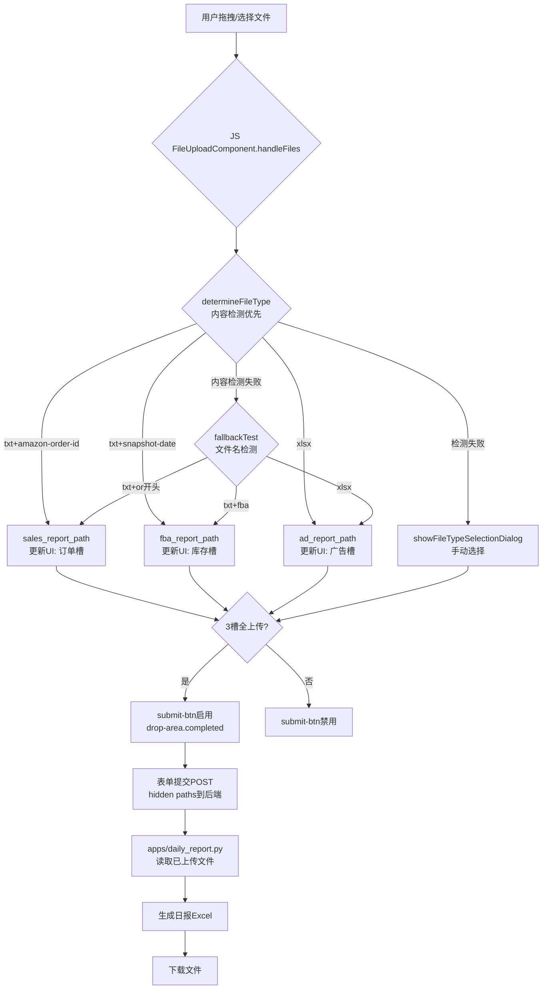

# 基于文件内容的分类功能设计文档

## 功能概述

为日报页面的文件上传功能添加了基于文件内容的智能分类机制，不再完全依赖文件名命名规范，提高了文件分类的准确性和用户体验。

## 技术实现

### 1. 文件内容特征识别

#### 订单文件 (sales_report)
- **文件格式**: .txt
- **内容特征**: 第一行包含 "amazon-order-id" 作为列名
- **备选方案**: 文件名以 "or" 开头（向后兼容）

#### FBA库存文件 (fba_report)
- **文件格式**: .txt
- **内容特征**: 第一行包含 "snapshot-date" 作为列名
- **备选方案**: 文件名包含 "fba"（向后兼容）

#### 广告报表 (ad_report)
- **文件格式**: .xlsx
- **内容特征**: 文件扩展名为 .xlsx
- **备选方案**: 文件扩展名为 .xlsx（相同）

### 2. 双重验证机制

系统采用双重验证机制确保文件分类的准确性：

1. **主要验证**: 基于文件内容特征检测
2. **辅助验证**: 基于文件名和扩展名检测（作为备选方案）

### 3. 前端实现

#### 3.1 文件内容读取功能
```javascript
async readFileContent(file) {
  return new Promise((resolve, reject) => {
    const reader = new FileReader();
    
    reader.onload = (e) => {
      resolve(e.target.result);
    };
    
    reader.onerror = () => {
      reject(new Error('文件读取失败'));
    };
    
    // 根据文件类型选择读取方式
    if (file.name.toLowerCase().endsWith('.txt')) {
      reader.readAsText(file, 'UTF-8');
    } else if (file.name.toLowerCase().endsWith('.xlsx')) {
      reader.readAsArrayBuffer(file);
    } else {
      reject(new Error('不支持的文件类型'));
    }
  });
}
```

#### 3.2 内容检测规则
```javascript
dailyRules: [
  {
    type: 'sales_report',
    contentTest: async (file, content) => {
      if (!file.name.toLowerCase().endsWith('.txt')) return false;
      const firstLine = content.split('\n')[0];
      return firstLine && firstLine.includes('amazon-order-id');
    },
    fallbackTest: (filename, ext) => ext === 'txt' && filename.startsWith('or')
  },
  {
    type: 'fba_report',
    contentTest: async (file, content) => {
      if (!file.name.toLowerCase().endsWith('.txt')) return false;
      const firstLine = content.split('\n')[0];
      return firstLine && firstLine.includes('snapshot-date');
    },
    fallbackTest: (filename, ext) => ext === 'txt' && filename.includes('fba')
  },
  {
    type: 'ad_report',
    contentTest: async (file, content) => {
      return file.name.toLowerCase().endsWith('.xlsx');
    },
    fallbackTest: (filename, ext) => ext === 'xlsx'
  }
]
```

#### 3.3 优化的文件类型确定流程
```javascript
async determineFileType(file) {
  const filename = file.name.toLowerCase();
  const ext = filename.split('.').pop().toLowerCase();
  
  // 选择对应的规则集
  const rules = this.options.isDailyReport ? this.options.dailyRules : this.options.rules;
  
  // 对于日报模式，首先尝试基于内容的检测
  if (this.options.isDailyReport) {
    for (const rule of rules) {
      try {
        // 显示检测状态
        this.updateFileItemUI(file, rule.type, 'analyzing');
        
        const content = await this.readFileContent(file);
        if (rule.contentTest && await rule.contentTest(file, content)) {
          // 检查该类型文件是否已上传
          if (!this.uploadedFiles[rule.type]) {
            return rule.type;
          }
          // 如果已上传，询问是否替换
          const shouldReplace = await this.confirmReplace(file, rule.type);
          if (shouldReplace) {
            return rule.type;
          }
        }
      } catch (error) {
        console.warn('内容检测失败，尝试文件名检测:', error);
        // 内容检测失败时，回退到文件名检测
        if (rule.fallbackTest && rule.fallbackTest(filename, ext)) {
          if (!this.uploadedFiles[rule.type]) {
            return rule.type;
          }
          const shouldReplace = await this.confirmReplace(file, rule.type);
          if (shouldReplace) {
            return rule.type;
          }
        }
      }
    }
  } else {
    // 非日报模式，使用原有的文件名检测
    for (const rule of rules) {
      if (rule.test(filename, ext)) {
        // 检查该类型文件是否已上传
        if (!this.uploadedFiles[rule.type]) {
          return rule.type;
        }
        // 如果已上传，询问是否替换
        const shouldReplace = await this.confirmReplace(file, rule.type);
        if (shouldReplace) {
          return rule.type;
        }
      }
    }
  }
  
  // 自动识别失败，显示手动选择对话框
  if (this.options.isDailyReport) {
    return await this.showFileTypeSelectionDialog(file);
  }
  
  return null;
}
```

### 4. 用户体验优化

#### 4.1 检测状态反馈
- 添加 "analyzing" 状态，显示"正在分析文件内容"
- 为分析状态添加专门的CSS样式（蓝色边框）
- 提供清晰的状态指示和进度反馈

#### 4.2 UI状态样式
```css
.file-item.analyzing {
    background: rgba(0, 150, 255, 0.1);
    border-left: 4px solid #0096ff;
}
```

#### 4.3 智能提示更新
- 更新文件类型提示，反映基于内容的分类方式
- 订单文件：".txt格式，内容包含'amazon-order-id'"
- FBA库存文件：".txt格式，内容包含'snapshot-date'"
- 广告报表：".xlsx格式"

## 流程图



## 文件结构

```
templates/data-analysis/
├── daily_report.html          # 更新：添加analyzing状态样式和提示文本
static/js/
├── components/
│   └── file-upload.js         # 增强：支持基于内容的分类
├── main.js                   # 更新：初始化日报文件上传
design_docs/
└── content_based_file_classification.md  # 新增：基于内容的分类文档
```

## 使用说明

1. 用户选择项目和日期
2. 拖拽或点击上传文件，系统自动分析文件内容进行分类
3. 分析过程中显示"正在分析文件内容"状态
4. 如果内容检测成功，文件自动分类到对应槽位
5. 如果内容检测失败，系统回退到文件名检测
6. 如果两种方式都失败，显示手动选择对话框
7. 上传完成后提交按钮启用，点击生成日报

## 技术特点

- **智能识别**：基于文件内容而非文件名，提高准确性
- **容错性强**：双重验证机制，内容检测失败时回退到文件名检测
- **向后兼容**：保留原有文件名检测作为备选方案
- **用户友好**：实时反馈分析状态，提供清晰的用户提示
- **可扩展性**：易于添加新的文件类型和检测规则

## 测试要点

1. 拖拽包含正确内容特征的文件，验证自动分类正确性
2. 拖拽内容特征不匹配的文件，验证回退机制
3. 拖拽完全无法识别的文件，验证手动选择对话框
4. 上传后删除文件，验证UI状态更新
5. 替换已上传文件，验证路径更新
6. 提交表单，验证后端正确读取文件
7. 生成日报，验证文件内容正确处理

## 扩展性

该设计具有良好的扩展性：
- 新增文件类型只需添加内容检测规则
- 可复用FileUploadComponent到其他页面
- 后端路由支持任意文件类型处理
- 内容检测规则可配置化，支持更复杂的检测逻辑

## 性能考虑

- 文件内容读取仅读取文件开头部分（第一行），减少内存占用
- 异步处理避免阻塞UI
- 错误处理确保系统稳定性
- 大文件处理时提供适当的用户反馈