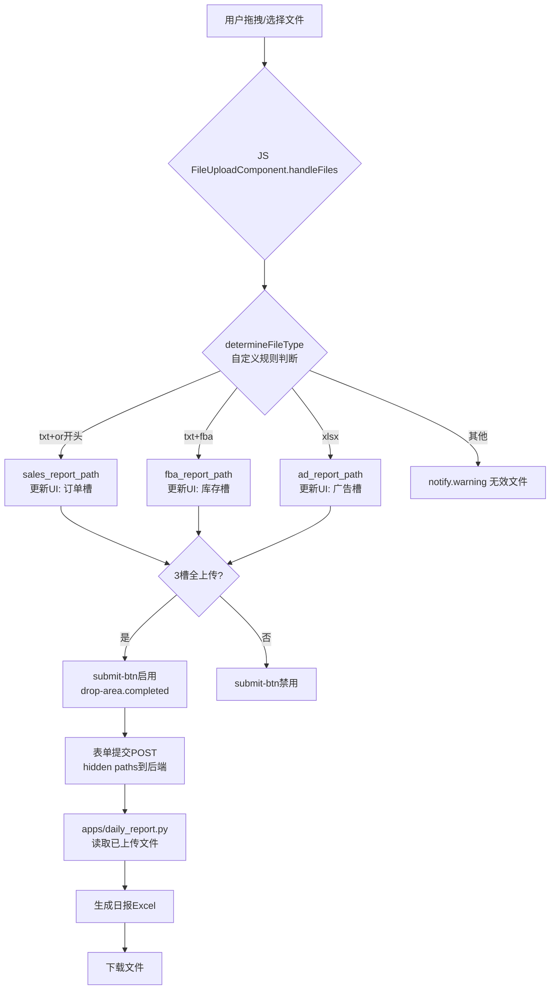

# 日报文件自动分类功能设计文档

## 功能概述

为日报页面添加了类似产品分析的拖拽上传功能，实现文件自动识别与分类：
- 文件名包含"fba"且为txt格式 → FBA库存
- 文件名包含"order"且为txt格式 → 所有订单
- xlsx格式 → 广告报表

## 技术实现

### 前端实现

#### 1. 模板更新 (templates/data-analysis/daily_report.html)
- 添加拖拽上传区域 (#drop-area)
- 三个文件槽位：所有订单、FBA库存、广告报表
- 隐藏的路径输入框用于存储已上传文件路径
- 复用产品分析页面的CSS样式

#### 2. 文件上传组件增强 (static/js/components/file-upload.js)
- 增加自定义规则支持 (rules选项)
- 支持动态文件类型名称、提示文本、提交按钮文本
- 改进determineFileType方法，优先使用自定义规则
- 通用化checkAllFilesUploaded，适配任意文件类型集合

#### 3. 主应用初始化 (static/js/main.js)
- 在initializeDailyReport中初始化FileUploadComponent
- 配置分类规则：
  - or开头且txt → sales_report
  - 包含fba且txt → fba_report
  - xlsx → ad_report
- 设置endpoint为/dataset/daily-report/upload-file

### 后端实现

#### 1. 文件上传路由 (apps/daily_report.py)
- 新增/upload-file路由处理单文件上传
- 修改主路由支持从路径读取已上传文件
- 增加日志记录与错误处理
- 兼容原有直接文件上传方式

## 流程图



## 文件结构

```
templates/data-analysis/
├── daily_report.html          # 更新：添加拖拽上传UI
static/js/
├── components/
│   └── file-upload.js         # 增强：支持自定义规则
├── main.js                   # 更新：初始化日报文件上传
apps/
└── daily_report.py            # 更新：新增上传路由
```

## 使用说明

1. 用户选择项目和日期
2. 拖拽或点击上传文件，系统自动按规则分类到对应槽位
3. 上传完成后提交按钮启用，点击生成日报
4. 后端读取已上传文件路径，生成并下载日报Excel

## 技术特点

- **向后兼容**：保留原有文件上传方式
- **组件复用**：FileUploadComponent通用化，支持多场景
- **用户体验**：拖拽上传、实时反馈、删除替换
- **安全性**：文件类型校验、路径安全处理

## 配置说明

### 文件分类规则配置
```javascript
rules: [
  {
    type: 'sales_report',
    test: (filename, ext) => ext === 'txt' && filename.startsWith('or')
  },
  {
    type: 'fba_report',
    test: (filename, ext) => ext === 'txt' && filename.includes('fba')
  },
  {
    type: 'ad_report',
    test: (filename, ext) => ext === 'xlsx'
  }
]
```

### 文件类型显示配置
```javascript
fileNames: {
  'sales_report': '所有订单',
  'fba_report': 'FBA库存',
  'ad_report': '广告报表'
},
fileTypeHints: {
  'sales_report': '.txt格式，以"or"开头',
  'fba_report': '.txt格式，包含"fba"',
  'ad_report': '.xlsx格式'
}
```

## 测试要点

1. 拖拽不同类型文件，验证自动分类正确性
2. 上传后删除文件，验证UI状态更新
3. 替换已上传文件，验证路径更新
4. 提交表单，验证后端正确读取文件
5. 生成日报，验证文件内容正确处理

## 扩展性

该设计具有良好的扩展性：
- 新增文件类型只需添加规则配置
- 可复用FileUploadComponent到其他页面
- 后端路由支持任意文件类型处理